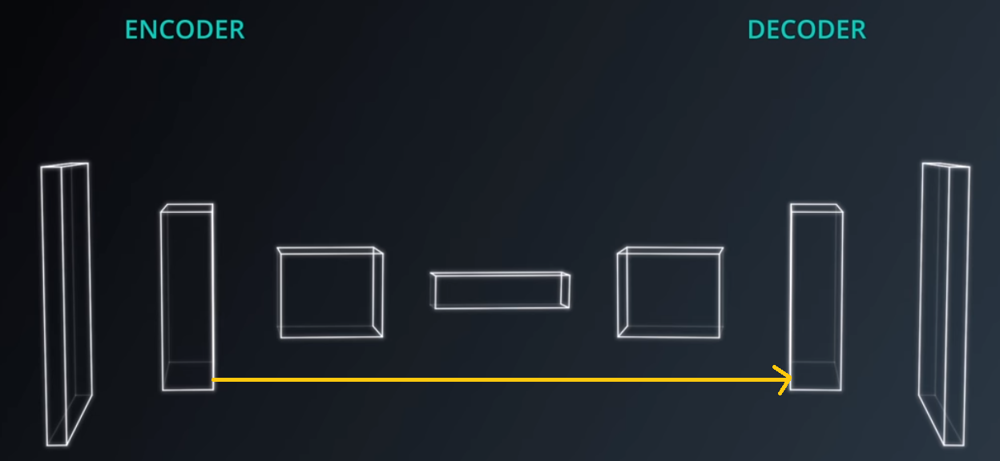

# Project: Semantic Segmentation
## Overview
This project is a python implementation of a Fully Convolutional Network (FCN) for semantically segmenting road images.

## How Does It Work?

Semantic segmentation is the task of assigning meaning to parts of an image based on different types of objects, such as cars, pedestrians, traffic lights, trees, etc. At the very basic level, this task concerns itself with assigning each pixel in the image to a target class. Consequently, this problem can be solved using a classifier. However, a conventional [CNN](https://en.wikipedia.org/wiki/Convolutional_neural_network) can't be used as it loses spatial information as we progress from *convolutional* to *fully connected* layers. To combat this loss of spatial information, we can use a [*Fully Convolutional Network (FCN)*](https://leonardoaraujosantos.gitbooks.io/artificial-inteligence/content/image_segmentation.html).

An FCN consists of two parts: *encoder* & *decoder*. The encoder extracts features from the image while the decoder up-scales the size of the encoder output back to the original input size. 




A pre-trained model, such as [VGG](https://arxiv.org/pdf/1409.1556v6.pdf) can be used as an encoder. This is followed by *1x1 Convolution* followed by *Transposed Convolutions* that up-scale the image size back to original. Another important aspect of FCN is the notion of *skip connections* whereby the output from encoder is connected to layers in the decoder, which helps the network to make more precise segmentation decisions.


The below image shows an example output from the FCN:


## FCN Implementation

### Architecture
The project's FCN implementation is based on the FCN architecture as descried [here](https://people.eecs.berkeley.edu/~jonlong/long_shelhamer_fcn.pdf). The encoder part of the FCN is based on a custom VGG16 provided by Udacity. After loading this pre-trained model, the reference architecture is replicated by adding 1x1 convolutions, up-sampling & creating skip connections between layers 3 & 7 and layers 4 & 7. Next the model is trained using the [Kitti Road dataset]([http://www.cvlibs.net/datasets/kitti/eval_road.php)  with *L2 Regularization* and *decaying learning rate*. Using decaying learning rate results in gradual decrease in the learning rate that helps with the learning process and decreasing loss.

## Hyperparameters

| Hyperparameter | Value | Description   		| 
|:---:|:---:|:-------------------------------| 			
| Learning Rate | 0.001 |Model's initial learning rate.|
| Learning Rate Decay | 0.90 |Percentage by which the learning rate decreases over time.|
| Decay Steps | 50 |Number of steps (batches) after which the decay rate is applied.|
| L2 Regularization | 0.001 |L2 Regularization (for preventing over fitting) value.|
| Batch Size | 5 |Number of images used for training during each batch (each epoch consists of N batches = ceiling(total images/batch size).|
| Epochs | 50 |Number of training cycles.|

One of the most important hyperparameter was the *epochs*. It was observed that increasing the number of epochs resulted in reducing the loss as shown by the following images & loss graphs:


## Segmented Images
## Segmented Movie


## Basic Build Instructions

1. Clone this repo.
2. Make a build directory: `mkdir build && cd build`
3. Compile: `cmake .. && make`
4. Run it: `./path_planning`.


## Dependencies

* cmake >= 3.5
  * All OSes: [click here for installation instructions](https://cmake.org/install/)
* make >= 4.1
  * Linux: make is installed by default on most Linux distros
  * Mac: [install Xcode command line tools to get make](https://developer.apple.com/xcode/features/)
  * Windows: [Click here for installation instructions](http://gnuwin32.sourceforge.net/packages/make.htm)
* gcc/g++ >= 5.4
  * Linux: gcc / g++ is installed by default on most Linux distros
  * Mac: same deal as make - [install Xcode command line tools]((https://developer.apple.com/xcode/features/)
  * Windows: recommend using [MinGW](http://www.mingw.org/)
* [uWebSockets](https://github.com/uWebSockets/uWebSockets)
  * Run either `install-mac.sh` or `install-ubuntu.sh`.
  * If you install from source, checkout to commit `e94b6e1`, i.e.
    ```
    git clone https://github.com/uWebSockets/uWebSockets 
    cd uWebSockets
    git checkout e94b6e1
    ```

## Usage

Follow the build instructions above. Once the program is running, start the simulator. You should see a *connected!!!* message upon successful connection between the simulator and the c++ program. Hit the *Start button*. 

## Directory Structure

* **data:** Directory containing a list of waypoints that go all the way around the track
* **images:** Directory containing writeup images
* **src:** Directory containing c++ source files
* **CMakeLists.txt:** File containing compilation instructions
* **README.md:** Project readme file
* **install-mac.sh:** Script for installing uWebSockets on Macintosh
* **install-ubuntu.sh:** Script for installing uWebSockets on Ubuntu

## License

The content of this project is licensed under the [Creative Commons Attribution 3.0 license](https://creativecommons.org/licenses/by/3.0/us/deed.en_US).
